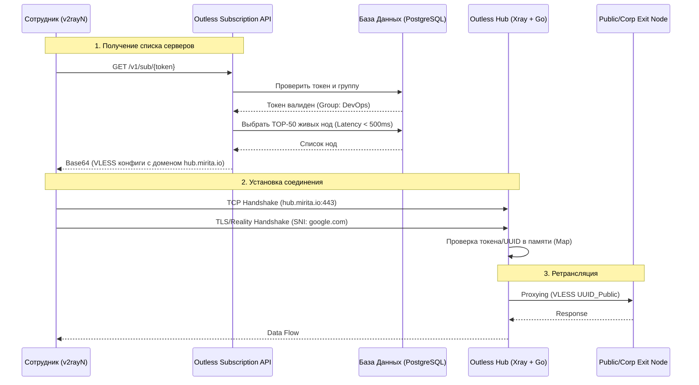

## 🗺 Схема получения данных (Client Journey)

Эта схема описывает путь от ввода ссылки в v2rayN до момента, когда сотрудник начинает пользоваться интернетом через твой Хаб.

---

## 🏗 Структура ответа API (Что видит клиент)

Чтобы маскировка работала идеально, ИИ должен генерировать ссылки следующего вида:

| Поле | Значение (Пример) | Комментарий |
| :--- | :--- | :--- |
| **Address** | `hub.mirita.io` | Всегда твой сервер |
| **Port** | `443` | Стандартный HTTPS |
| **UUID** | `user-private-uuid` | Личный UUID сотрудника |
| **SNI** | `google.com` | Маскировка под Reality |
| **Path** | `/pl-1` или `user-id.pl` | Позволяет Хабу понять, куда слать трафик |
| **Remark** | `[PL] Outless-Public-1` | Красивое имя в клиенте |

---